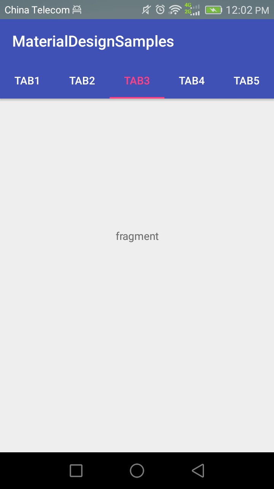
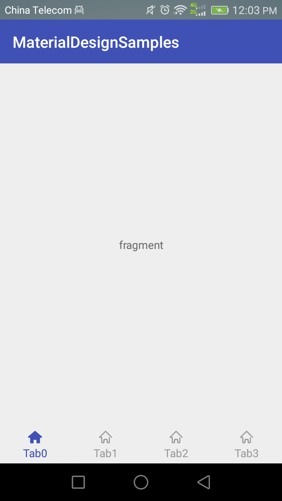
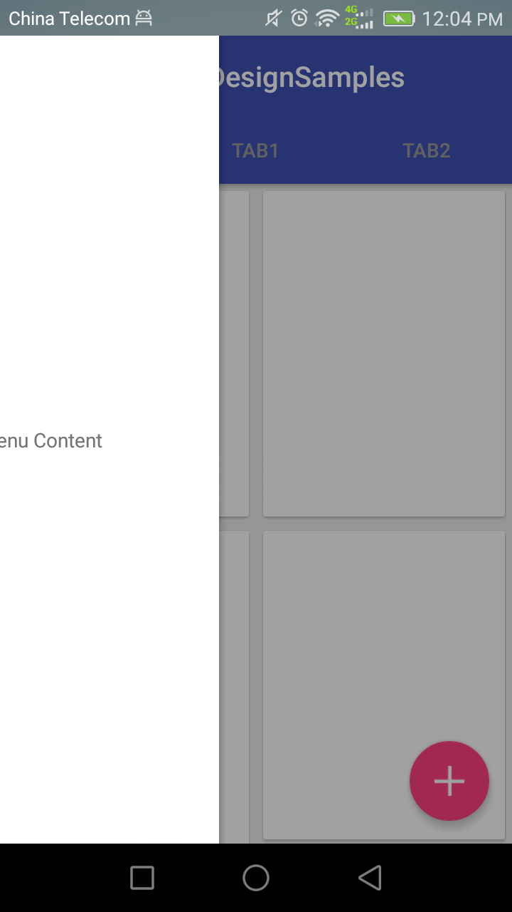
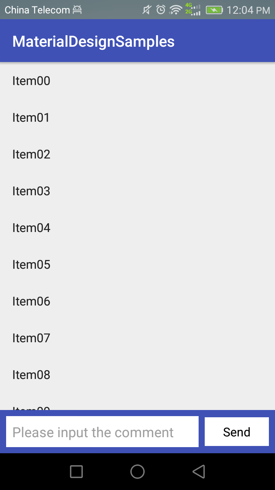
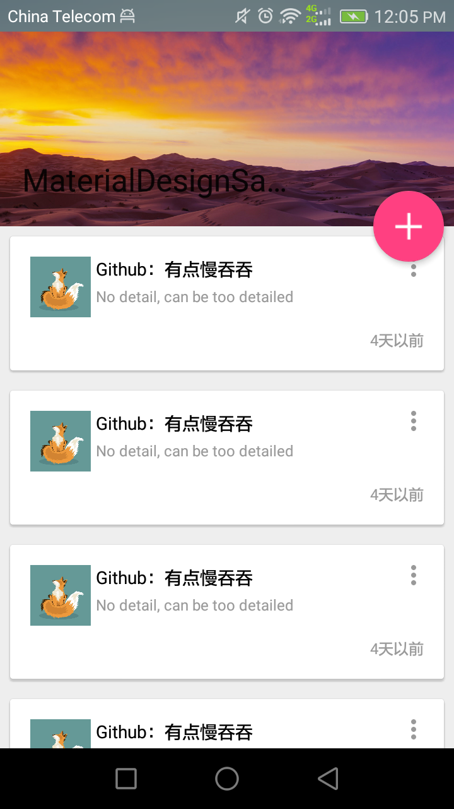

# MaterialDesignSimples  
================
MaterialDesign的几个最常见使用方式举例。

1.**顶部 tab 标签页**  

  

2.**底部 tab 菜单栏**  

  

3.**悬浮按钮( FloatingActionButton ) + 抽屉布局( DrawerLayout ) + RecyclerView**  

  

4.**悬浮View + 自定义 Behavior**  

  

5.**顶部滚动菜单栏**  

//from test 
//from testme
//from testme2
